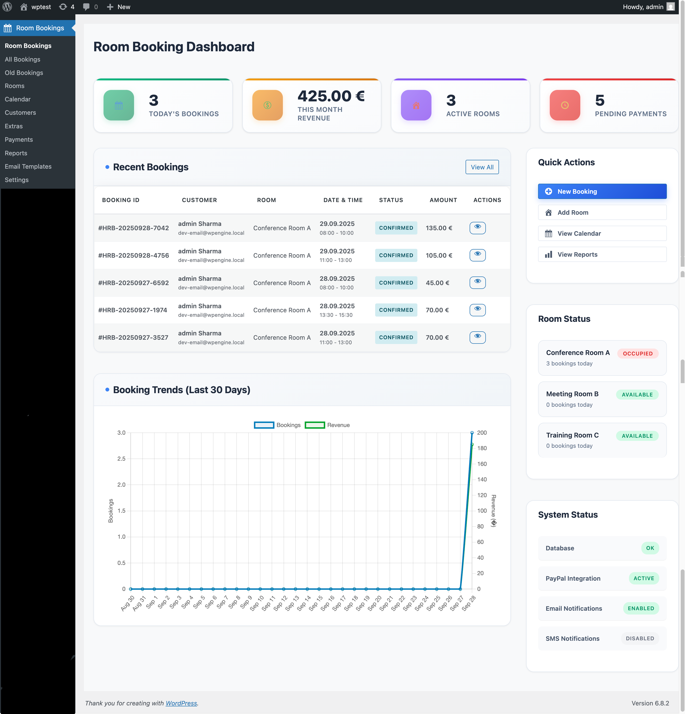
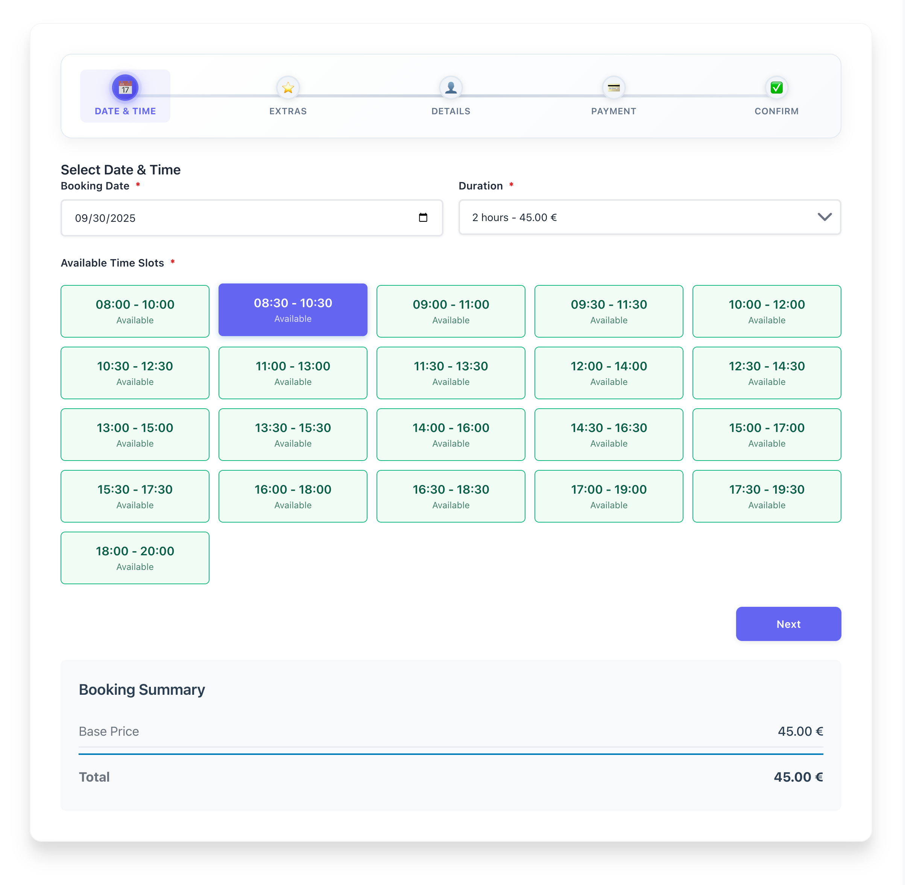
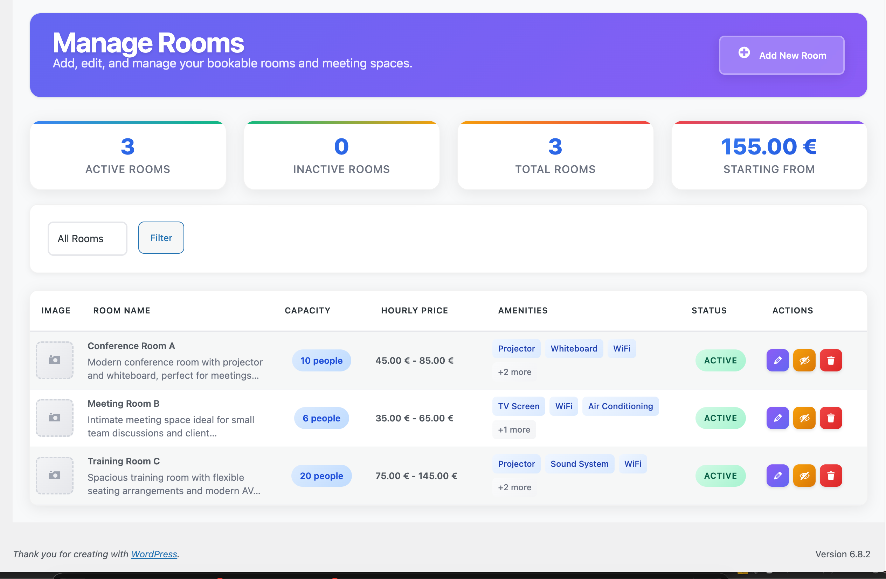
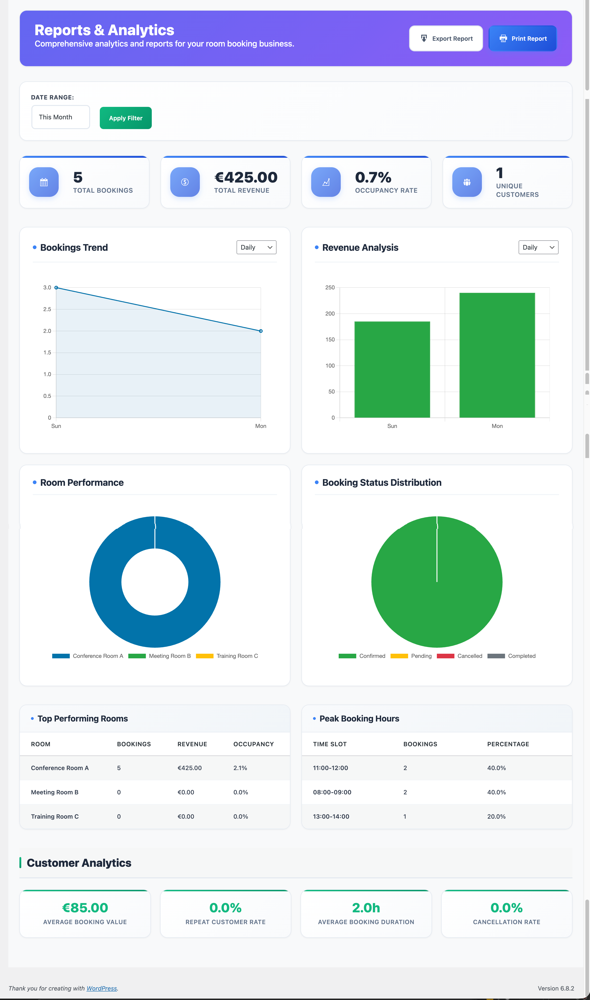

# 🏨 Hourly Room Booking System

[](https://wordpress.org/)
[](https://php.net/)
[](https://www.gnu.org/licenses/gpl-2.0.html)
[](https://github.com/yourusername/hourly-room-booking)

A comprehensive WordPress plugin for managing hourly room reservations with advanced features including payment processing, stock management, and multi-channel notifications.

## ✨ Features

### 🏢 **Room Management**
- **Multi-Room Support** - Unlimited rooms with individual settings
- **Image Management** - Multiple images per room with WordPress media library
- **Amenities System** - JSON-based amenities with icons
- **Pricing Flexibility** - Room-specific pricing with global fallbacks
- **Real-time Availability** - Live availability checking

### 📅 **Booking System**
- **Hourly Booking** - Precise time slot management
- **Duration-Based Pricing** - 2, 3, 4+ hour pricing tiers
- **Extra People Support** - Additional person charges
- **Special Requests** - Custom requirements handling
- **Unique Booking References** - HRB-YYYYMMDD-XXXX format

### 📦 **Stock Management**
- **Real-time Stock Tracking** - Live availability for extras
- **Time-based Availability** - Stock checked against booking duration
- **Overlap Prevention** - Prevents double-booking of limited items
- **Automatic Stock Updates** - Real-time inventory management

### 💰 **Pricing System**
- **Multi-Currency Support** - USD and EUR with proper formatting
- **Room-Specific Pricing** - Individual room rates
- **Global Default Pricing** - Fallback pricing system
- **PayPal Fee Calculation** - 3% fee for PayPal payments
- **Tax Support** - Configurable tax rates

### 👥 **Customer Management**
- **Guest Booking** - No registration required
- **User Integration** - WordPress user account linking
- **Verification System** - Email/SMS OTP verification
- **Customer History** - Complete booking history tracking

### 💳 **Payment Processing**
- **PayPal Integration** - Secure PayPal API v2 integration
- **On-site Payments** - Manual payment processing
- **Multi-Currency** - USD and EUR support
- **Refund Management** - Automated refund processing
- **Payment Logging** - Complete audit trail

### 📧 **Notification System**
- **Email Templates** - Customizable email templates with variables
- **SMS Notifications** - Twilio integration for SMS
- **WhatsApp Integration** - WhatsApp Business API support
- **Multi-language Ready** - i18n support

### 📊 **Admin Dashboard**
- **Real-time Statistics** - Live booking and revenue data
- **Analytics & Reports** - Comprehensive reporting system
- **Bulk Operations** - Mass booking management
- **Email Template Editor** - Rich text editor for templates

## 🚀 Quick Start

### Prerequisites
- WordPress 5.0 or higher
- PHP 7.4 or higher
- MySQL 5.6 or higher
- 128MB memory minimum

### Installation

1. **Download the plugin**
   ```bash
   git clone https://github.com/yourusername/hourly-room-booking.git
   ```

2. **Upload to WordPress**
   - Upload the `hourly-room-booking` folder to `/wp-content/plugins/`
   - Or install via WordPress admin: Plugins → Add New → Upload Plugin

3. **Activate the plugin**
   - Go to Plugins → Installed Plugins
   - Find "Hourly Room Booking" and click "Activate"

4. **Configure settings**
   - Go to Room Booking → Settings
   - Set up your currency, payment methods, and notifications

## ⚙️ Configuration

### Basic Setup
1. **General Settings**
   - Set your preferred currency (USD/EUR)
   - Configure date and time formats
   - Set timezone

2. **Room Setup**
   - Create rooms with pricing
   - Upload room images
   - Set amenities

3. **Payment Configuration**
   - Configure PayPal credentials
   - Set up on-site payment options

4. **Notification Setup**
   - Configure email templates
   - Set up SMS/WhatsApp (optional)

## 📱 Usage

### For Customers
1. **Browse Available Rooms**
   - Select date and time
   - Choose room and duration
   - Add extras if needed

2. **Complete Booking**
   - Fill in customer details
   - Choose payment method
   - Confirm booking

3. **Receive Confirmation**
   - Email confirmation
   - SMS/WhatsApp notifications (if enabled)

### For Administrators
1. **Manage Bookings**
   - View all bookings
   - Update booking status
   - Process payments

2. **Room Management**
   - Add/edit rooms
   - Set pricing
   - Manage availability

3. **Reports & Analytics**
   - View booking statistics
   - Revenue reports
   - Customer analytics

## 🛠️ Development

### File Structure
```
hourly-room-booking/
├── includes/
│   ├── class-booking-manager.php      # Booking operations
│   ├── class-room-manager.php         # Room management
│   ├── class-payment-handler.php      # Payment processing
│   ├── class-notification-manager.php # Notifications
│   ├── class-currency-manager.php     # Currency handling
│   ├── class-input-validator.php      # Input validation
│   ├── class-database.php             # Database operations
│   └── class-admin.php                # Admin interface
├── admin/views/                        # Admin interface views
├── public/                            # Frontend assets
├── templates/                         # Email templates
└── docs/                             # Documentation
```

### Database Schema
The plugin creates 8 custom tables:
- `wp_hrb_rooms` - Room information
- `wp_hrb_customers` - Customer data
- `wp_hrb_bookings` - Booking records
- `wp_hrb_payments` - Payment transactions
- `wp_hrb_extras` - Extra items/services
- `wp_hrb_booking_extras` - Booking extras relationship
- `wp_hrb_email_templates` - Email templates
- `wp_hrb_otp_verification` - OTP verification

### Hooks & Filters
```php
// Custom hooks
do_action('hrb_booking_created', $booking_id);
do_action('hrb_booking_updated', $booking_id);
do_action('hrb_payment_completed', $payment_id);

// Custom filters
apply_filters('hrb_booking_price', $price, $booking_data);
apply_filters('hrb_email_template', $template, $event);
```

## 🔒 Security Features

- **Input Validation** - Comprehensive input sanitization
- **SQL Injection Prevention** - All queries use `$wpdb->prepare()`
- **XSS Protection** - All output properly escaped
- **CSRF Protection** - Nonce verification on all forms
- **Payment Security** - Secure payment processing
- **File Upload Security** - WordPress media library integration

## 📊 Screenshots

### Admin Dashboard


### Booking Form


### Room Management


### Reports & Analytics


## 🤝 Contributing

We welcome contributions! Please follow these steps:

1. **Fork the repository**
2. **Create a feature branch**
   ```bash
   git checkout -b feature/amazing-feature
   ```
3. **Commit your changes**
   ```bash
   git commit -m 'Add some amazing feature'
   ```
4. **Push to the branch**
   ```bash
   git push origin feature/amazing-feature
   ```
5. **Open a Pull Request**

### Development Guidelines
- Follow WordPress coding standards
- Add proper documentation
- Include unit tests for new features
- Test with multiple WordPress versions

## 📝 Changelog

### Version 1.0.0
- Initial release
- Complete booking system
- PayPal integration
- Email notifications
- Admin dashboard
- Stock management
- Multi-currency support

## 🐛 Bug Reports

Found a bug? Please report it:

1. **Check existing issues** - Search for similar issues
2. **Create new issue** - Use the bug report template
3. **Provide details** - Include steps to reproduce
4. **Attach logs** - Include relevant error logs

## 💡 Feature Requests

Have an idea? We'd love to hear it:

1. **Check existing requests** - Search for similar ideas
2. **Create new request** - Use the feature request template
3. **Describe the feature** - Explain the use case
4. **Get community feedback** - Discuss with other users

## 📞 Support

### Documentation
- [Complete Documentation](HOURLY-ROOM-BOOKING-DOCUMENTATION.md)
- [API Reference](docs/api-reference.md)
- [FAQ](docs/faq.md)

### Community
- [GitHub Discussions](https://github.com/yourusername/hourly-room-booking/discussions)
- [WordPress Support Forum](https://wordpress.org/support/plugin/hourly-room-booking)

### Professional Support
- Email: support@yourcompany.com
- Website: https://yourcompany.com

## 📄 License

This project is licensed under the GPL v2 or later - see the [LICENSE](LICENSE) file for details.

## 🙏 Acknowledgments

- WordPress community for the amazing platform
- PayPal for payment processing
- Twilio for SMS services
- WhatsApp for Business API
- All contributors and testers

## ⭐ Star History

[](https://star-history.com/#yourusername/hourly-room-booking&Date)

---

**Made with ❤️ for the WordPress community**

[](https://wordpress.org/)
[](https://php.net/)
[](https://www.gnu.org/licenses/gpl-2.0.html)